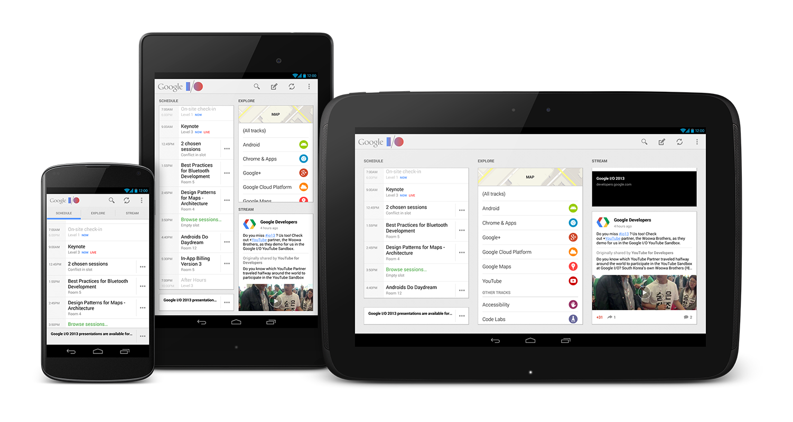

Google I/O 2013 App Source
==========================

This is the un-official Google I/O 2013 App Source Code hosted on GitHub
(obviously) but [originally hosted on Google Code][1], and pretty much will stay
there (in case you want to follow up on new commits et al - can't really say
it's a mirror since I can't promise to update changes). The app supports devices
running Android 2.3.3+, and is optimized for phones and tablets of all shapes
and sizes.

If you want, you can [download the app here from Google Play][2].

With the app, you can:

* View the conference agenda and edit your personal schedule
* Sync your schedule between all of your devices and the I/O website
* View detailed session, code lab, office hours, and speaker information, including speaker bios, photos, and Google+ profiles
* +1 sessions right from the app
* Participate in public #io13 conversations on Google+
* Guide yourself using the vector-based conference map
* Get a reminder a few minutes before sessions in your schedule are due to start
* View information about companies in the Developer Sandbox
* Keep up with announcements from the I/O team during the conference
* View your schedule on your Android 3.0+ device's home and lock screens using widget
* Play "I/O Live" session video streams on your Android 3.0+ devices
* Beam session details from your Android 4.0, NFC-enabled device to another using Android Beam
* Scan attendee badges on your NFC-enabled device

So it's a great resource for learning. Enjoy!

[1]: https://code.google.com/p/iosched/
[2]: https://play.google.com/store/apps/details?id=com.google.android.apps.iosched
